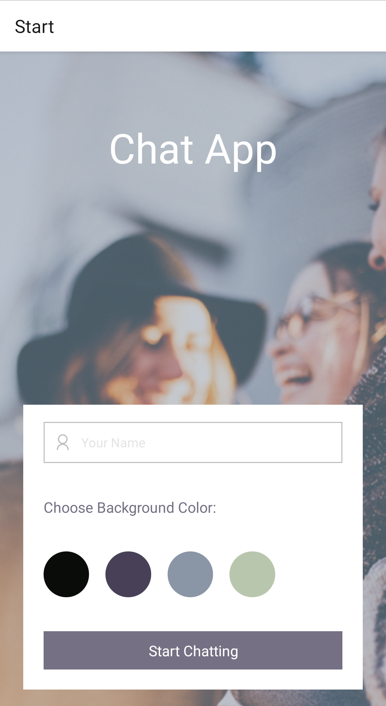
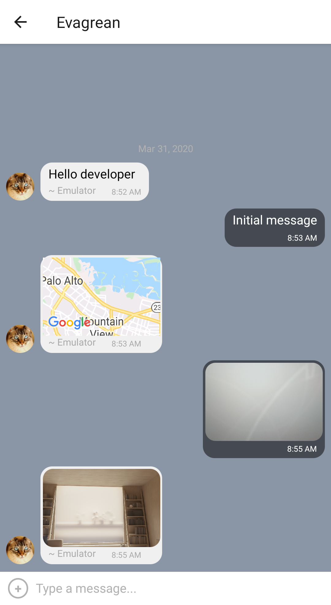

# Native Mobile Chat App

This is a chat app for mobile devices built with React-Native. It provides users with a chat interface where they can send/receive text messages and images as well as share their location. It was the final project for my full-stack web development bootcamp.

# Demo

  

[Watch video](https://evagrean.github.io/chat-app-demo/)

# Prerequisites

- Install [Expo](https://expo.io/): `npm install expo-cli -g`

- For Windows and Linux: Install [Android Studio](https://developer.android.com/studio).<br>
  For more information how to set up an emulator, look [here](https://docs.expo.io/versions/latest/workflow/android-studio-emulator/)

- For Mac: Install [XCode](https://developer.apple.com/xcode/)

- Install the Expo app on your mobile device (available in Google Play Store and Apple Store)

# Getting started

- To install all the dependencies: `npm i`

- To start the app: `expo/npm start`

- Launch app on physical device: scan QR code in Expo GUI

- Launch app on emulator: Press "Run on Android device/emulator in Expo GUI

# Built with

- [expo](https://docs.expo.io/versions/latest/)
- [expo-image-picker](https://docs.expo.io/versions/latest/sdk/imagepicker/)
- [expo-location](https://docs.expo.io/versions/latest/sdk/location/)
- [expo-permissions](https://docs.expo.io/versions/latest/sdk/permissions/)
- [firebase](https://firebase.google.com/docs/firestore/)
- [react](https://reactjs.org/)
- [react-dom](https://www.npmjs.com/package/react-dom)
- [react-native](https://github.com/expo/react-native/archive/sdk-36.0.0.tar.gz)
- [react-native-gifted-chat](https://github.com/FaridSafi/react-native-gifted-chat)
- [react-native-keyboard-spacer](https://www.npmjs.com/package/react-native-keyboard-spacer)
- [react-native-maps](https://docs.expo.io/versions/v35.0.0/sdk/map-view/)
- [react-native-web](https://www.npmjs.com/package/react-native-web)
- [react-navigation](https://reactnavigation.org/docs/getting-started/)
- [react-navigation-stack](https://github.com/expo/react-navigation-stack)

# Database information

This project uses [Google Firebase/Firestore](https://firebase.google.com/) for data storage.<br>
If you get stuck at any point,check the [Firebase documentation](https://firebase.google.com/docs/web/setup)

## Set up Firestore for your React Native project

1. Sign in, then click on "Go to console" link

2. Choose to start in test mode, so we don't need to create any security rules

3. Install Firestore via Firebase in your project: `npm install firebase`

4. Import Firestore in your App.js file
```javascript
const firebase = require('firebase');
require ('firebase/firestore');
```
5. Back in the Firestore project in your browser, open up "Settings", then "General" tab. Under the section "Your apps" you can generate configurations for different platforms. Here, click "Firestore for Web". Copy the contents of the `config` object.

6. In your Chat.js file create a constructor in the App class. Here you can paste the data you copied from `config` object.  

> Example
> ```javascript
>firebase.initializeApp({
apiKey: "your-api-key",
authDomain: "your-authdomain",
databaseURL: "your-database-url",
projectId: "your-project-id",
storageBucket: "your-storage-bucket",
messagingSenderId: "your-messaging-sender-id",
appId: "your-app-id"
});
> ```
**Note: You'd need to copy the configuration info from your own Firstore database!**

7. Create a reference to the Firestore collection: 
```javascript
this.referenceMessages = firebase.firestore().collection('chat');`
```

# Links

[Kanban board](https://trello.com/b/ZFwOsZLi/chat-app)